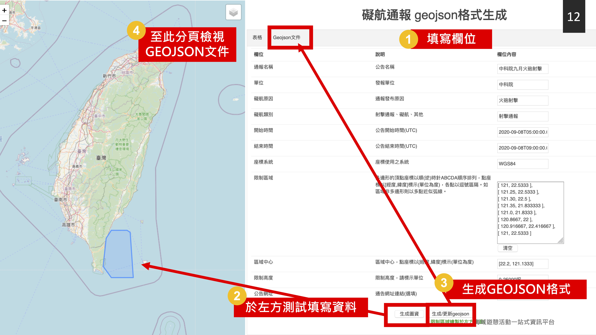
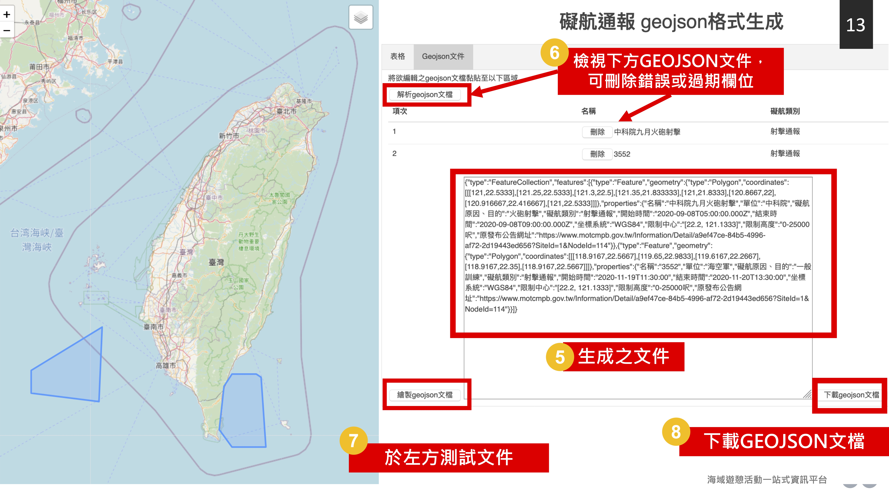

# restricted-area-to-geojson
礙航及限制水域通報geojson轉檔小工具
[https://oac-tw.github.io/restricted-area-to-geojson/](https://oac-tw.github.io/restricted-area-to-geojson/)

## 說明

網頁右側有表格及Geojson兩分頁，表格分頁可填寫欄位後使用下方兩個按鈕：

* 生成圖資：將表格欄位繪製於左方地圖中檢視
* 生成/更新geojson: 將上方欄位內容生成geojson後加入Geojson分頁之檔案內容區域

Geojson 分頁可分析及編輯geojson檔案

* 解析本geojson文檔： 按下後解析編輯區geojson檔案之通報數量
* 繪製本geojson文檔： 按下後將編輯區geojson檔案繪製於左方地圖中檢視

